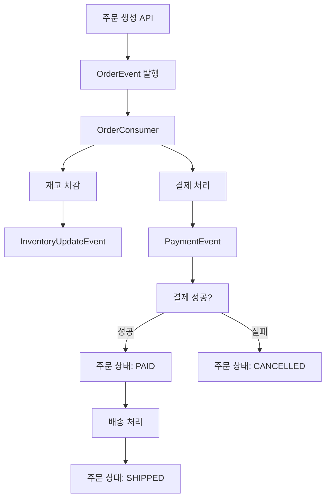

# Hello Kafka - Kotlin Spring Boot 예제

Kotlin과 Spring Boot를 사용한 Apache Kafka 학습용 프로젝트입니다.

## 📋 프로젝트 구조

```
src/main/kotlin/com/ioob/hellokafka/
├── HelloKafkaApplication.kt          # 메인 애플리케이션
├── config/
│   └── KafkaConfig.kt                # Kafka 설정
├── controller/
│   └── KafkaController.kt            # REST API 컨트롤러
├── model/
│   └── Models.kt                     # 데이터 모델들
├── service/
│   ├── ProducerServices.kt           # Producer 서비스들
│   └── ConsumerServices.kt           # Consumer 서비스들
```

## 🚀 시작하기

### 1. Kafka 실행하기

```bash
# Docker Compose로 Kafka 클러스터 실행
docker-compose up -d

# 상태 확인
docker-compose ps

# 로그 확인
docker-compose logs -f kafka
```

### 2. 애플리케이션 실행

```bash
# Gradle로 실행
./gradlew bootRun

# 또는 IDE에서 HelloKafkaApplication.kt 실행
```

### 3. Kafka UI 접속

브라우저에서 http://localhost:8090 접속하여 Kafka 클러스터 상태를 모니터링할 수 있습니다.

## 📡 API 사용법

### 헬스체크

```bash
curl http://localhost:8080/api/kafka/health
```

### 간단한 메시지 전송

```bash
curl -X POST http://localhost:8080/api/kafka/message \
  -H "Content-Type: application/json" \
  -d '{"message": "Hello Kafka!"}'
```

### 키-값 메시지 전송

```bash
curl -X POST "http://localhost:8080/api/kafka/message/keyed?key=user123" \
  -H "Content-Type: application/json" \
  -d '{"message": "사용자별 메시지"}'
```

### 주문 생성

```bash
curl -X POST http://localhost:8080/api/kafka/order \
  -H "Content-Type: application/json" \
  -d '{
    "userId": "USER001",
    "productId": "PROD001", 
    "productName": "아이폰 15",
    "quantity": 1,
    "unitPrice": 1200000
  }'
```

### 주문 상태 업데이트

```bash
curl -X PUT "http://localhost:8080/api/kafka/order/ORDER-12345/status?status=PAID"
```

### 샘플 데이터 생성 (테스트용)

```bash
curl -X POST http://localhost:8080/api/kafka/sample
```

### API 사용법 가이드

```bash
curl http://localhost:8080/api/kafka/usage
```

## 🔧 주요 Kafka 개념 실습

### 1. Producer (메시지 발송자)

- `MessageProducerService`: 간단한 문자열 메시지 전송
- `OrderProducerService`: 주문 이벤트 발행
- `InventoryProducerService`: 재고 업데이트 이벤트 발행
- `PaymentProducerService`: 결제 이벤트 발행

### 2. Consumer (메시지 수신자)

- `MessageConsumerService`: 간단한 메시지 처리
- `OrderConsumerService`: 주문 이벤트 처리 및 후속 작업
- `InventoryConsumerService`: 재고 관리
- `PaymentConsumerService`: 결제 처리 및 주문 상태 업데이트
- `EventMonitoringService`: 모든 이벤트 모니터링

### 3. 토픽 (Topic)

- `simple-messages`: 간단한 메시지용
- `order-events`: 주문 관련 이벤트
- `inventory-updates`: 재고 업데이트 이벤트
- `payment-events`: 결제 관련 이벤트

## 📊 이벤트 플로우



## 🧪 테스트 시나리오

### 시나리오 1: 기본 메시지 전송

1. 간단한 메시지 전송
2. 로그에서 Producer와 Consumer 동작 확인
3. Kafka UI에서 토픽과 메시지 확인

### 시나리오 2: 주문 처리 플로우

1. 주문 생성 API 호출
2. 주문 이벤트 → 재고 처리 → 결제 처리 순서로 실행
3. 각 단계별 로그 확인
4. 최종 주문 상태 확인

### 시나리오 3: 파티셔닝과 컨슈머 그룹

1. 같은 키로 여러 메시지 전송
2. 다른 키로 메시지 전송
3. 메시지들이 어떤 파티션에 들어가는지 확인

## 🛠️ 고급 기능 실습

### 컨슈머 그룹 확인

```bash
docker exec -it kafka kafka-consumer-groups \
  --bootstrap-server localhost:9092 \
  --list
```

### 토픽 상세 정보 확인

```bash
docker exec -it kafka kafka-topics \
  --bootstrap-server localhost:9092 \
  --describe \
  --topic order-events
```

### 메시지 직접 확인

```bash
# Producer로 메시지 전송
docker exec -it kafka kafka-console-producer \
  --bootstrap-server localhost:9092 \
  --topic simple-messages

# Consumer로 메시지 수신
docker exec -it kafka kafka-console-consumer \
  --bootstrap-server localhost:9092 \
  --topic simple-messages \
  --from-beginning
```

## 🐛 트러블슈팅

### Kafka 연결 오류

1. Docker 컨테이너 상태 확인: `docker-compose ps`
2. Kafka 로그 확인: `docker-compose logs kafka`
3. 포트 충돌 확인: `netstat -an | grep 9092`

### 메시지 수신이 안 될 때

1. 컨슈머 그룹 상태 확인
2. 토픽 파티션 상태 확인
3. 애플리케이션 로그 레벨을 DEBUG로 변경

### JSON 직렬화 오류

1. 모델 클래스에 기본 생성자 확인
2. Jackson 어노테이션 확인
3. Trusted packages 설정 확인

## 📚 추가 학습 자료

- [Apache Kafka 공식 문서](https://kafka.apache.org/documentation/)
- [Spring for Apache Kafka 문서](https://spring.io/projects/spring-kafka)
- [Confluent Platform 문서](https://docs.confluent.io/)

## 🔧 환경 정리

```bash
# 컨테이너 중지 및 제거
docker-compose down

# 볼륨까지 제거 (데이터 완전 삭제)
docker-compose down -v
```

## 💡 다음 단계

1. **Kafka Streams**: 실시간 스트림 처리
2. **Schema Registry**: 스키마 진화와 호환성 관리  
3. **Kafka Connect**: 외부 시스템과의 데이터 연동
4. **운영 환경 설정**: 보안, 모니터링, 성능 튜닝
